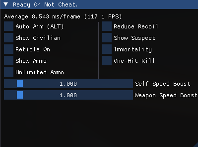

# Ready Or Not Cheat
This repository develops a cheat library for the game `Ready Or Not`. It includes a `.dll` file designed to hook into the game's `d3d11.dll`, and an accompanying `.exe` file to facilitate the injection of the `.dll` into the game's space.
## DISCLAIMER
This repository is intended for educational purposes only. Please refrain from using it for any illegal activities. The author disclaims any responsibility for misuse or any adverse consequences resulting from such misuse.
## Functionality

The dynamic library provides the following functionalities:

- Display Ammo
- Unlimited Ammo
- Aim Bot
- Display Civilian 
- Display Suspect
- Reticle On
- Reduce Recoil
- Immortality
- One-Hit Kill
- Speed Up
- Weapon Speed Up

  

### Display Ammo
This game does not show how many bullets you have in each magazine, so if player turns it on, he can easily track the remaining bullets.

  

### Unlimited Ammo
Your primary weapon usually only has 30 bullets each magazine. Turning on this will give you infinite bullets.

  

### Aim Bot
This bot helps you locate the nearest `head` of all suspects, and move you mouse to the `head` with in 1 frame.
  

  

### Display Civilian
It can display a blue skeleton of every civilian in the game.

  

### Display Suspect
It can display a red skeleton of every suspect in the game.

  

### Reticle On
The game, by defualt, will not display a reticle on screen. This can help you aim better.

  

### Reduce Recoil
 It decrease the recoil and spread of your weapon. And also reduces camera shake.
 

  

 ### Immortality
 If you turn it on, suspect will not be able to heart you.
 

  

 ### One-Hit Kill
 This will increase your weapon damage and weapon damage to a very large number, enabling you to kill the suspect easier.
 
 

  

 ### Speed Up
 Adjust the time dilation of yourself. You can move faster with it.
 
 

  

 ### Weapon Speed Up
 Same as above.
 
 

  

 ## TODO
 - Finish the user inference 
 - Develop a driver to inject the `.dll` on Ring 0 level.